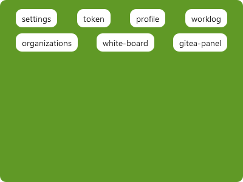

# GiteaPanel  
**A Gitea shortcut panel built based on UserScript; The configuration information of the panel is stored in the user-defined gitea repository in case of loss.**  

## Preparation
1. Create a repository on your Gitea instance to store GiteaPanel custom data.  
You can add mirror repo from [https://github.com/kerwin612/us-giteapanel](https://github.com/kerwin612/us-giteapanel)
2. Create a PAT(Access Token) in your Gitea profile.  
The current Gitea profile settings page link is: **GITEA_HOST/user/settings/applications**

## Install
[https://openuserjs.org/install/kerwin612/GiteaPanel.min.user.js](https://openuserjs.org/install/kerwin612/GiteaPanel.min.user.js)

## Configuration  

* `gitea_host` **Your Gitea instance host**
* `owner` **Your username on Gitea**
* `token` **Your PAT(Access Token) on Gitea**
* `repo` **repo where data is stored**
* `ref` **branch where the data is stored**

**GiteaPanel will get the configured main.js in the following way**  
`GET -H 'accept': 'application/json' -H 'authorization': 'token ${token}' '${gitea_host}/api/v1/repos/${owner}/${repo}/contents/main.js?ref=${ref}'`  

### default  
> /owner/us-giteapanel/raw/branch/customization/main.js  
> more complete example, see: [us-giteapanel/customization](https://github.com/kerwin612/us-giteapanel/blob/customization/main.js)  
```js
function main(ctx) {

    function showToken() {
        alert(ctx.config.token);
    }

    return {
        labels: [
            {
                label: 'profile',
                click: () => {
                    window.location.href = `/${ctx.config.owner}`;
                }
            },
            {
                label: 'token',
                click: showToken
            }
        ]
    };

}
```

## Screenshot  

* **settings**  
  

* **example**  
  

* **customization**  
  

